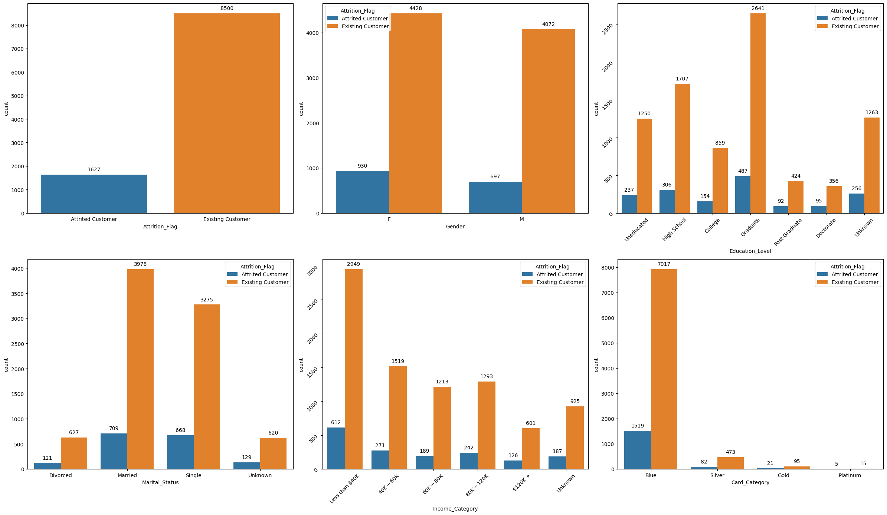
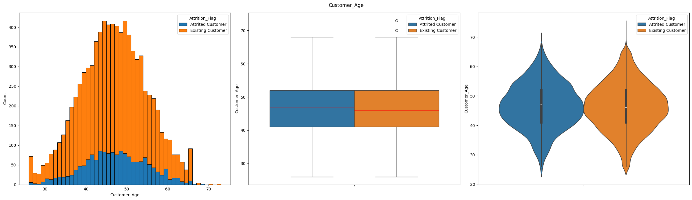
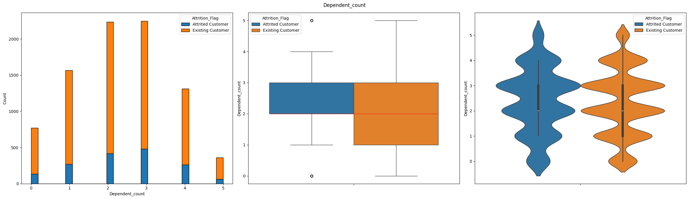
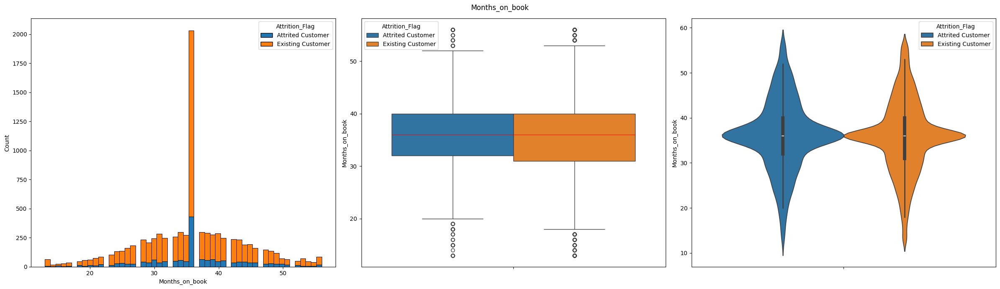
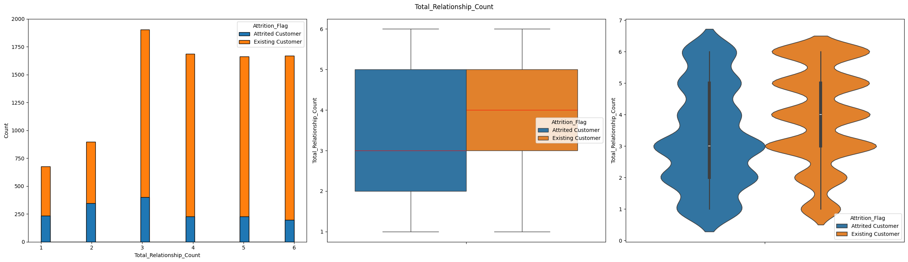

# Save my business - Churn prediction

Churn prediction is a critical aspect of business analytics, as it focuses on identifying customers who are
likely to discontinue their use of a product or service. This is particularly important because the cost of
acquiring new customers often outweighs the cost of retaining existing ones

By accurately predicting which customers are at risk of churning, businesses can proactively intervene with targeted retention strategies, personalized offers, or improved customer support. This not only helps to reduce customer churn and protect revenue streams but also provides valuable insights into customer behavior and preferences, enabling businesses to enhance their products, services, and overall customer experience.


## Project structure

```
├─ img/
├─ models/
├─ notebooks/
```

`img`: images used to document this project <br />
`models`: serialized models <br />
`notebooks`: notebooks used during analysis and model training <br />

## Business understanding

Customer churn, the rate at which customers discontinue their relationship with a business, represents a
significant challenge impacting revenue and profitability.  This project aims to understand the drivers of
churn and develop effective retention strategies. A high churn rate necessitates increased customer
acquisition efforts, which are generally more expensive than retaining existing customers.  Therefore,
minimizing churn is crucial for sustainable growth and maximizing customer lifetime value.

The data objective of this project is to develop a predictive model capable of identifying customers at high
risk of churn. This model will leverage customer data, including demographics, transaction history, product
usage, and interactions with the business, to predict the likelihood of a customer discontinuing their relationship with this business.  The output of the model will be a churn probability score for each
customer, enabling the bank to prioritize retention efforts and implement targeted interventions for those
identified as most likely to churn.  This predictive capability will be crucial for proactively mitigating
customer attrition and maximizing customer lifetime value.


## Data understanding

The dataset, provided as a CSV file, contains over 10,000 client observations. The original file included the following attributes:

- **CLIENTNUM**: Unique client identification number.
- **Attrition_Flag**: Customer activity status (Attrited Customer/Current Customer).
- **Customer_Age**: Customer age in years.
- **Gender**: Customer gender (M/F).
- **Dependent_count**: Number of dependents.
- **Education_Level**: Educational qualification.
- **Marital_Status**: Marital status (Married, Single, Divorced, Unknown).
- **Income_Category**: Annual income category (< $40,000, $40,000 - $60,000, $60,000 - $80,000, $80,000 - $120,000, > $120,000, Unknown).
- **Card_Category**: Card type (Blue, Silver, Gold, Platinum).
- **Months_on_book**: Relationship tenure with the bank.
- **Total_Relationship_Count**: Number of products held.
- **Month_Inactive_12_mon**: Inactive months in the last 12 months.
- **Contacts_Count_12_mon**: Contacts in the last 12 months.
- **Credit_Limit**: Credit limit.
- **Total_Revolving_Bal**: Revolving balance.
- **Avg_Open_To_Buy**: Average open-to-buy credit.
- **Total_Amt_Chng_Q4_Q1**: Change in transaction amount (Q4/Q1).
- **Total_Trans_Amt**: Total transaction amount (last 12 months).
- **Total_Trans_Ct**: Total transaction count (last 12 months).
- **Total_Ct_Chng_Q4_Q1**: Change in transaction count (Q4/Q1).
- **Avg_Utilization_Ratio**: Average credit card utilization rate.
- **Naive_Bayes_Classifier_Attrition_Flag_Card_Category_Contacts_Count_12_mon_Dependent_count_Education_Level_Months_Inactive_12_mon_1**: Naive Bayes classification.
- **Naive_Bayes_Classifier_Attrition_Flag_Card_Category_Contacts_Count_12_mon_Dependent_count_Education_Level_Months_Inactive_12_mon_2**: Naive Bayes classification.

The initial dataset contained three columns deemed irrelevant for the analysis and were subsequently removed:
- CLIENTNUM
- Naive_Bayes_Classifier_Attrition_Flag_Card_Category_Contacts_Count_12_mon_Dependent_count_Education_Level_Months_Inactive_12_mon_1
- Naive_Bayes_Classifier_Attrition_Flag_Card_Category_Contacts_Count_12_mon_Dependent_count_Education_Level_Months_Inactive_12_mon_2

### Exploratory analysis

#### Categorical variables

The initial step involved assessing data quality to determine the necessity of addressing null values or duplicate observations. Upon inspection, the dataset was found to contain neither missing values nor duplicate entries.

Subsequently, the `describe` method was employed to generate a summary of descriptive statistics and distributional characteristics for the numeric columns. This analysis confirmed the absence of erroneous values, such as negative values, across all columns. Notably, the numeric attributes exhibited significant variations in scale, suggesting the potential need for data normalization or standardization.

Following the initial data quality assessment, we proceeded to analyze each column, beginning with the categorical features. We visualized the distribution of values within each categorical column, stratifying the analysis by 'Attrited Customers' and 'Current Customers' to understand their respective representations relative to the target variable.



The dataset exhibits a class imbalance, with a significantly higher proportion of _Current Customer_ observations compared to _Attrited Customers_. This imbalance is typical, as a healthy business generally retains a larger customer base.

Regarding _gender_, the client population is relatively balanced between males and females, and there appears to be no significant difference in attrition rates between these groups.

Analysis of _education level_ reveals that the majority of customers possess a Graduate degree or lower. However, the proportion of _Attrited Customers_ mirrors the overall class distribution, indicating no specific educational level is associated with higher churn. _Marital status_ also follows the general class distribution, with 'Married' and 'Divorced' customers representing the majority in both 'Current Customer' and _Attrited Customer_ categories.

In terms of _income category_, the majority of customers fall within the lower income brackets. However, the distribution of _Attrited Customers_ does not show any prominent peaks across income categories.

Finally, the _card category_ distribution demonstrates that a large proportion of customers hold lower-tier cards, with minimal representation of premium cardholders. Similar to other categorical variables, no specific card category appears to exhibit a significantly higher churn rate

#### Numeric variables
Following the analysis of categorical variables, we explored the numeric features. Similar to the previous approach, we visualized the distribution of each numeric variable, segmented by _Current Customers_ and _Attrited Customers_. The objective was to identify any significant differences in distribution patterns between these groups and to uncover any notable data variations.



Customer age exhibited no discernible difference between the 'Current Customer' and 'Attrited Customer' groups. The age distribution closely approximates a Gaussian distribution in both cases, with an overall mean of approximately 46 years and a standard deviation of 8 years.



The dependent count also showed no significant distributional differences between the _Current Customer_ and _Attrited Customer_ groups. The majority of customers have 2 to 3 dependents. _Attrited Customers_ exhibited a more concentrated distribution, with fewer observations at 0 or 1 dependents, whereas _Current Customers_ displayed a more dispersed distribution._ Despite these variations, both groups maintained a median dependent count of 2.



The _Months on Book_ variable demonstrated a similar distribution across both _Current Customer_ and _Attrited Customer_ groups, resembling a Gaussian distribution. Both classes exhibited comparable medians and density patterns. Notably, the histogram revealed a prominent peak at 36 months for both groups, indicating a significantly higher concentration of clients within this tenure period. This observation warrants further in-depth analysis to ascertain whether it stems from potential data anomalies or reflects distinct client profile characteristics during this specific timeframe.



The _Total Relationship Count_, denoting the number of products held by a client, reveals a subtle distributional difference between _Attrited Customers_ and _Current Customers_. Approximately 50% of _Attrited Customers_ possess 3 or fewer products, with a concentration primarily between 2 and 3. Conversely, the median for _Current Customers_ is 4, indicating that 50% of these clients hold 4 or fewer products, with the highest density observed above 3 products.