# Save my business - Churn prediction

Churn prediction is a critical aspect of business analytics, as it focuses on identifying customers who are likely to discontinue their use of a product or service. This is particularly important because the cost of acquiring new customers often outweighs the cost of retaining existing ones

By accurately predicting which customers are at risk of churning, businesses can proactively intervene with targeted retention strategies, personalized offers, or improved customer support. This not only helps to reduce customer churn and protect revenue streams but also provides valuable insights into customer behavior and preferences, enabling businesses to enhance their products, services, and overall customer experience.


## Project structure

```
├─ img/
├─ models/
├─ notebooks/
```

`img`: images used to document this project <br />
`models`: serialized models <br />
`notebooks`: notebooks used during analysis and model training <br />

## Business understanding

Customer churn, the rate at which customers discontinue their relationship with a business, represents a significant challenge impacting revenue and profitability.  This project aims to understand the drivers of churn and develop effective retention strategies. A high churn rate necessitates increased customer acquisition efforts, which are generally more expensive than retaining existing customers.  Therefore, minimizing churn is crucial for sustainable growth and maximizing customer lifetime value.

The data objective of this project is to develop a predictive model capable of identifying customers at high risk of churn. This model will leverage customer data, including demographics, transaction history, product usage, and interactions with the business, to predict the likelihood of a customer discontinuing their relationship with this business.  The output of the model will be a churn probability score for each customer, enabling the bank to prioritize retention efforts and implement targeted interventions for those identified as most likely to churn.  This predictive capability will be crucial for proactively mitigating customer attrition and maximizing customer lifetime value.


## Data understanding

The dataset, provided as a CSV file, contains over 10,000 client observations. The original file included the following attributes:

- **CLIENTNUM**: Unique client identification number.
- **Attrition_Flag**: Customer activity status (Attrited Customer/Current Customer).
- **Customer_Age**: Customer age in years.
- **Gender**: Customer gender (M/F).
- **Dependent_count**: Number of dependents.
- **Education_Level**: Educational qualification.
- **Marital_Status**: Marital status (Married, Single, Divorced, Unknown).
- **Income_Category**: Annual income category (< $40,000, $40,000 - $60,000, $60,000 - $80,000, $80,000 - $120,000, > $120,000, Unknown).
- **Card_Category**: Card type (Blue, Silver, Gold, Platinum).
- **Months_on_book**: Relationship tenure with the bank.
- **Total_Relationship_Count**: Number of products held.
- **Month_Inactive_12_mon**: Inactive months in the last 12 months.
- **Contacts_Count_12_mon**: Contacts in the last 12 months.
- **Credit_Limit**: Credit limit.
- **Total_Revolving_Bal**: Revolving balance.
- **Avg_Open_To_Buy**: Average open-to-buy credit.
- **Total_Amt_Chng_Q4_Q1**: Change in transaction amount (Q4/Q1).
- **Total_Trans_Amt**: Total transaction amount (last 12 months).
- **Total_Trans_Ct**: Total transaction count (last 12 months).
- **Total_Ct_Chng_Q4_Q1**: Change in transaction count (Q4/Q1).
- **Avg_Utilization_Ratio**: Average credit card utilization rate.
- **Naive_Bayes_Classifier_Attrition_Flag_Card_Category_Contacts_Count_12_mon_Dependent_count_Education_Level_Months_Inactive_12_mon_1**: Naive Bayes classification.
- **Naive_Bayes_Classifier_Attrition_Flag_Card_Category_Contacts_Count_12_mon_Dependent_count_Education_Level_Months_Inactive_12_mon_2**: Naive Bayes classification.

The initial dataset contained three columns deemed irrelevant for the analysis and were subsequently removed:
- CLIENTNUM
- Naive_Bayes_Classifier_Attrition_Flag_Card_Category_Contacts_Count_12_mon_Dependent_count_Education_Level_Months_Inactive_12_mon_1
- Naive_Bayes_Classifier_Attrition_Flag_Card_Category_Contacts_Count_12_mon_Dependent_count_Education_Level_Months_Inactive_12_mon_2

### Exploratory analysis

#### Data description and quality assessment

The initial step involved assessing data quality to determine the necessity of addressing null values or duplicate observations. Upon inspection, the dataset was found to contain neither missing values nor duplicate entries.

Subsequently, the `describe` method was employed to generate a summary of descriptive statistics and distributional characteristics for the numeric columns. This analysis confirmed the absence of erroneous values, such as negative values, across all columns. Notably, the numeric attributes exhibited significant variations in scale, suggesting the potential need for data normalization or standardization.

#### Categorical variables

Following the initial data quality assessment, we proceeded to analyze each column, beginning with the categorical features. We visualized the distribution of values within each categorical column, stratifying the analysis by 'Attrited Customers' and 'Current Customers' to understand their respective representations relative to the target variable.


The dataset exhibits a class imbalance, with a significantly higher proportion of _Current Customer_ observations compared to _Attrited Customers_. This imbalance is typical, as a healthy business generally retains a larger customer base.

Regarding _gender_, the client population is relatively balanced between males and females, and there appears to be no significant difference in attrition rates between these groups.

Analysis of _education level_ reveals that the majority of customers possess a Graduate degree or lower. However, the proportion of _Attrited Customers_ mirrors the overall class distribution, indicating no specific educational level is associated with higher churn. _Marital status_ also follows the general class distribution, with 'Married' and 'Divorced' customers representing the majority in both 'Current Customer' and _Attrited Customer_ categories.

In terms of _income category_, the majority of customers fall within the lower income brackets. However, the distribution of _Attrited Customers_ does not show any prominent peaks across income categories.

Finally, the _card category_ distribution demonstrates that a large proportion of customers hold lower-tier cards, with minimal representation of premium cardholders. Similar to other categorical variables, no specific card category appears to exhibit a significantly higher churn rate

#### Numeric variables
Following the analysis of categorical variables, we explored the numeric features. Similar to the previous approach, we visualized the distribution of each numeric variable, segmented by _Current Customers_ and _Attrited Customers_. The objective was to identify any significant differences in distribution patterns between these groups and to uncover any notable data variations.


Customer age exhibited no discernible difference between the 'Current Customer' and 'Attrited Customer' groups. The age distribution closely approximates a Gaussian distribution in both cases, with an overall mean of approximately 46 years and a standard deviation of 8 years.


The dependent count also showed no significant distributional differences between the _Current Customer_ and _Attrited Customer_ groups. The majority of customers have 2 to 3 dependents. _Attrited Customers_ exhibited a more concentrated distribution, with fewer observations at 0 or 1 dependents, whereas _Current Customers_ displayed a more dispersed distribution._ Despite these variations, both groups maintained a median dependent count of 2.


The _Months on Book_ variable demonstrated a similar distribution across both _Current Customer_ and _Attrited Customer_ groups, resembling a Gaussian distribution. Both classes exhibited comparable medians and density patterns. Notably, the histogram revealed a prominent peak at 36 months for both groups, indicating a significantly higher concentration of clients within this tenure period. This observation warrants further in-depth analysis to ascertain whether it stems from potential data anomalies or reflects distinct client profile characteristics during this specific timeframe.


The _Total Relationship Count_, denoting the number of products held by a client, reveals a subtle distributional difference between _Attrited Customers_ and _Current Customers_. Approximately 50% of _Attrited Customers_ possess 3 or fewer products, with a concentration primarily between 2 and 3. Conversely, the median for _Current Customers_ is 4, indicating that 50% of these clients hold 4 or fewer products, with the highest density observed above 3 products.

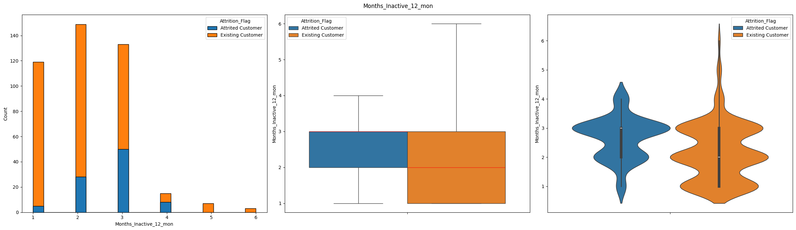

The _Months Inactive in the Last 12 Months_ variable revealed a subtle difference between the _Attrited Customer_ and _Current Customer_ groups. _Attrited Customers_ exhibited a slightly higher number of inactive months, with the majority experiencing 2 to 3 months of inactivity within the past year. In contrast, _Current Customers_ showed a lower concentration of clients at higher inactivity periods, with 50% experiencing 2 or fewer inactive months, and 75% distributed between 1 and 3 months.

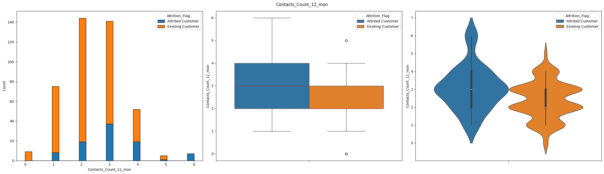

The _Number of Contacts in the Last 12 Months_ variable revealed a notable difference between the _Attrited Customer_ and _Current Customer_ groups. _Attrited Customers_ exhibited a higher frequency of contacts, potentially indicating dissatisfaction. The majority of _Attrited Customers_ had 2 to 4 contacts within the past year, whereas _Current Customers_ primarily had 2 to 3 contacts, with a concentration at the 2 contacts level.

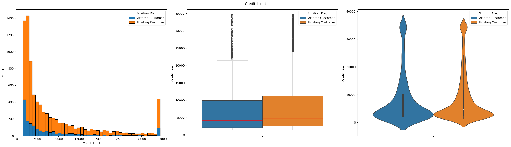

The _Credit Limit_ variable exhibited a highly similar distribution between the _Current Customer_ and _Attrited Customer_ groups, with _Current Customers_ demonstrating a marginally higher overall credit limit. Notably, the distribution is heavily skewed towards lower values, indicating a significantly larger client base with lower credit limits. However, a distinct client segment with substantially higher credit limits deviates from this pattern. This warrants further in-depth analysis to elucidate the criteria for these elevated credit limits.

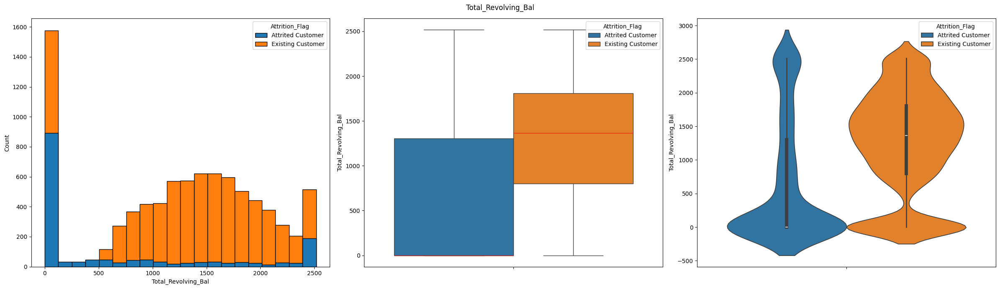

The _Total Revolving Balance_ variable reveals a notable distributional difference between _Current Customers_ and _Attrited Customers_. While both groups exhibit a concentration of clients with low revolving balances, _Current Customers_ demonstrate a denser distribution at higher values, primarily between 750 and 1750. Conversely, approximately 50% of _Attrited Customers_ maintain a revolving balance close to zero. This observation is counterintuitive, as one might hypothesize that customer attrition would correlate with higher revolving balances due to potential financial strain.

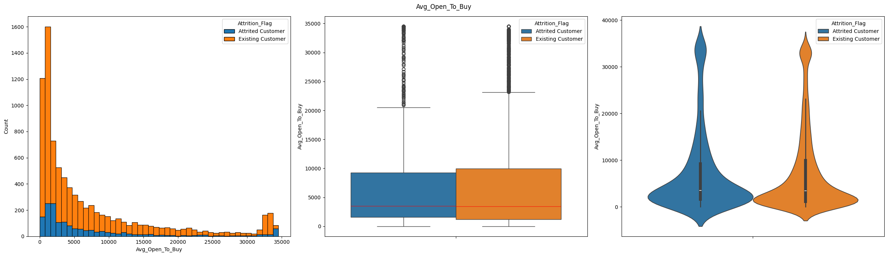

The _Average Open to Buy_ variable exhibits a similar distribution across both _Current Customer_ and _Attrited Customer_ groups, with a skew towards lower values. Both classes present comparable median values, suggesting that this variable, in isolation, may have limited utility for client classification.

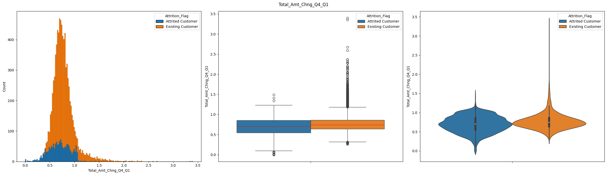

The _Total Amount Change Q4 to Q1_ variable reveals a subtle distributional difference between the _Attrited Customer_ and _Current Customer_ groups. _Attrited Customers_ exhibit a dispersed distribution towards the lower end, with the majority ranging from 0.6 to 0.8, and outliers extending to 1.5 and some instances of 0. Conversely, _Current Customers_ show no instances of 0 change, with the majority concentrated between 0.7 and 0.85, and a higher prevalence of outliers reaching values close to 3.5.

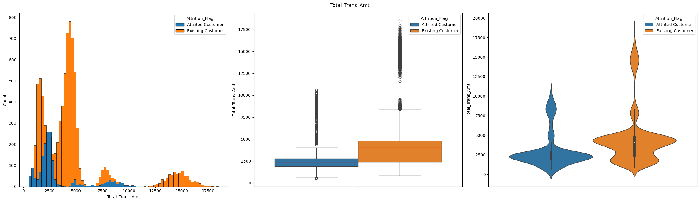

The _Total Transaction Amount_ variable also reveals a distributional difference between the groups. _Attrited Customers_ exhibit a concentration at lower values, with a median of 2500, and outliers extending to approximately 10500. The majority of _Attrited Customers_ are concentrated between 2250 and 2750. In contrast, _Current Customers_ demonstrate a generally higher transaction amount, with a median of nearly 5000 and the majority ranging from 2500 to 5000. Outliers in this group reach values exceeding 17500

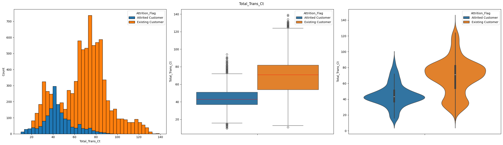

The _Total Transaction Count_ variable displays the most pronounced difference between the two customer groups. _Attrited Customers_ exhibit a distribution skewed towards lower values, with a median of approximately 45 and the majority of clients concentrated between 40 and 50 transactions. Conversely, _Current Customers_ demonstrate a median of nearly 80, with the majority concentrated between 60 and 80 transactions. This indicates that _Attrited Customers_ tend to perform significantly fewer transactions than _Current Customers_.

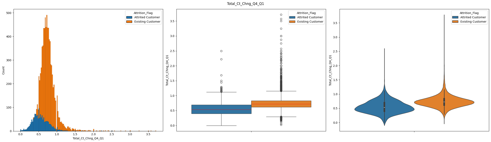

The _Total Count Change Q4 to Q1_ variable demonstrates a similar distributional pattern between the two customer groups. However, _Attrited Customers_ exhibit a skew towards lower values, with a median close to 0.5, while _Current Customers_ have a median near 0.75. Additionally, _Current Customers_ display a higher frequency of outliers, with some exceeding values greater than 3.5.

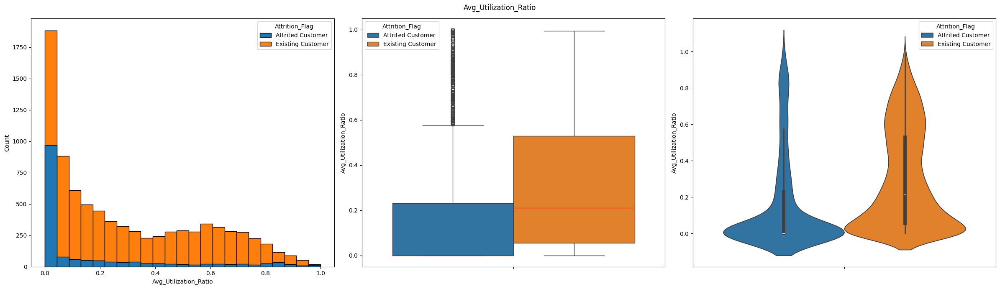

The 'Average Utilization Ratio' variable corroborates the findings observed in the 'Transaction Count' variable. 'Attrited Customers' exhibit significantly lower utilization ratios, with a median very close to zero and 75% of clients at or below 0.2. Conversely, 'Current Customers' display virtually no observations at 0, a median near 0.2, and the majority of clients ranging from 0.1 to 0.6. The distribution of 'Current Customers' also reveals an absence of outliers.

#### Exploring _Months on Book_

The 'Months on Book' variable revealed an anomalous concentration of customers at the 36-month mark.

To investigate this phenomenon, we conducted a focused analysis of customers with precisely 36 months of tenure. This subset did not exhibit significant deviations from the overall dataset. A plausible hypothesis is that the business executed a targeted customer acquisition campaign during that specific month. The success of this campaign warrants further investigation, as this strategy may prove beneficial for future implementation.

#### Exploring _Credit Limit_

The 'Credit Limit' variable revealed a different behaviou for clients with high credit limits, while the overall tendency was to have a lower number of clients when the credit limit increased this wasn't true for the higher class limit class.

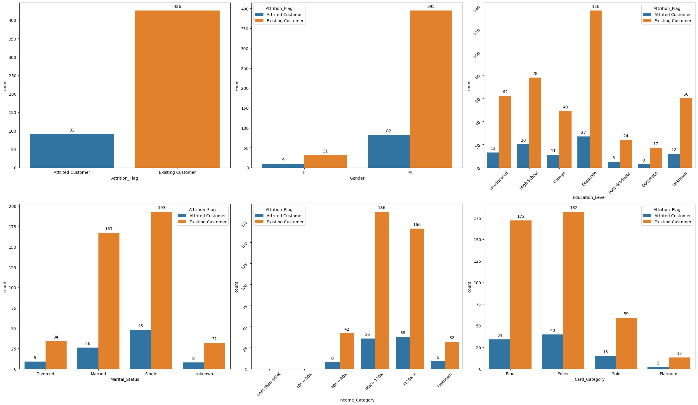

Analyzing the categorical variables for clients with high credit limits reveals notable differences compared to the overall dataset.

Firstly, a gender imbalance is evident within this segment. While the overall distribution demonstrates a balance between males and females, the high-credit customer base is predominantly male, with a distribution of 93% male and 7% female.

Secondly, the income category distribution is skewed towards higher earners. Within the high-credit segment, no customers fall below the $60k-$80k income bracket, and the majority reside in the $80k-$120k and above $120k categories.

Thirdly, the card category distribution, while still showing a concentration in lower-tier cards, indicates that 15 out of the 20 Platinum cardholders are high-credit customers.

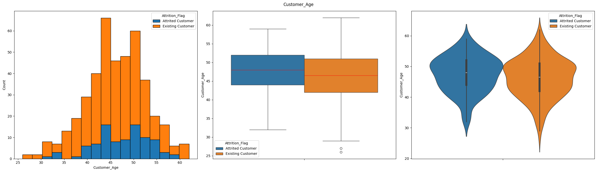

The age distribution of high credit limit clients exhibits a higher concentration compared to the overall dataset. While the mean age for both datasets is approximately 46 years, the standard deviation for high credit limit clients is two years lower than that of the overall population.

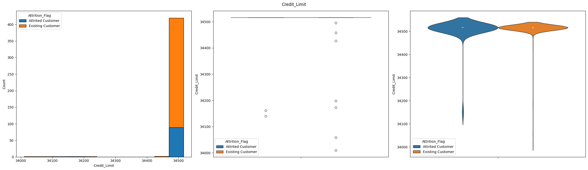

The mean credit limit for clients in the high credit limit category was $34,511, compared to the overall mean of $7,469. This represents a 4.6-fold increase. Additionally, the standard deviation for the high credit limit group was approximately $42, while the overall standard deviation was $9,090.

Of the 10,127 customers analyzed, only 517 belonged to the high credit limit segment, representing approximately 5% of the total customer base. This highlights the exclusivity and concentration of this client segment.

## Data preparation

As the original dataset contained no missing values or duplicates, our data preparation focused on encoding categorical features and scaling numeric features. This is essential to prevent algorithms from assigning undue importance to variables with larger numerical values.

For categorical encoding, we employed `OneHotEncoder` on the following variables: _Gender_, _Education_Level_, _Marital_Status_, _Income_Category_, and _Card_Category_. To optimize resource utilization, one column was dropped for binary variables, effectively reducing redundancy.

Numeric variables were scaled using `MinMaxScaler`, ensuring all numeric values were transformed to a uniform range between 0 and 1.

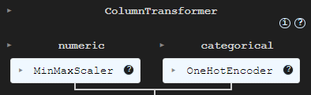

#### Handling data leakage

Data leakage in machine learning occurs when a model uses information during training that wouldn't be available at the time of prediction. Leakage causes a predictive model to look accurate until deployed in its use case; then, it will yield inaccurate results, leading to poor decision-making and false insights.

* **_Target leakage_**: Models include data that will not be available when the model is used to make predictions. Using information that won't be available during real-world predictions leads to overfitting, where the model performs exceptionally well on training and validation data but poorly in production.

* **_Train-test contamination_**: When both training and validation data are used to create a model, often due to improper splitting or preprocessing.

To mitigate _target leakage_, we previously removed any columns or information that would not be available during future predictions.

To prevent _train-test contamination_, we initially partitioned the original dataset into training and testing sets. Subsequently, the `OneHotEncoder` and `MinMaxScaler` were fitted exclusively on the training data and then utilized solely for transforming the testing data.


## Modeling

Our objective is to develop a predictive model capable of identifying customers at high risk of churn, which necessitates classifying customers as potential churners. To achieve this, we selected and evaluated two classification models:

* **_Logistic Regression_**: Logistic regression is a supervised machine learning algorithm commonly used for binary classification tasks, specifically in our case, to distinguish between 'Attrited Customers' and 'Current Customers'. This method employs the logistic (or sigmoid) function to transform a linear combination of input features into a probability value between 0 and 1. This probability represents the likelihood that an input belongs to one of two predefined categories.

* **_Random Forest Classifier_**: Random forest, an ensemble learning method, is utilized for classification, regression, and other tasks. It operates by constructing multiple decision trees during the training phase. For classification, the random forest's output is determined by the class voted for by the majority of trees. For regression, it outputs the average of the trees' predictions. Random forests effectively mitigate the tendency of decision trees to overfit the training data.

Prior to training, the target variable, _Attrition_Flag_, was encoded using a `LabelEncoder`. Subsequently, the dataset was partitioned into training and testing sets using the `train_test_split` function from the `scikit-learn` library. The dataset was split with 20% allocated to the testing set and 80% to the training set.

```
X_train, X_test, y_train, y_test = train_test_split(X, y_encoded, test_size=.2, stratify=y, random_state=99)
```

#### Handling imbalance

As observed during the analysis phase, the dataset exhibited a class imbalance, with a significantly higher number of _Current Customer_ samples compared to _Attrited Customer_ samples. Machine learning algorithms, designed to optimize overall accuracy, tend to favor the majority class. Consequently, the minority class is often underrepresented during training, leading to biased predictions and poor generalization for the minority class.

To address this issue, we employed an oversampling technique. In machine learning, oversampling increases the number of samples in the underrepresented class to mitigate class imbalance. This technique aims to rectify the bias introduced when one class significantly outweighs another. We selected the Synthetic Minority Oversampling Technique (SMOTE), specifically the implementation from the `imbalanced-learn` library.

SMOTE operates by identifying closely located examples in the feature space, drawing a line between them, and generating a new synthetic sample along that line. Specifically, a random example from the minority class is chosen, and its k nearest neighbors (typically k=5) are identified. A randomly selected neighbor is used to create a synthetic example at a random point between the two examples in feature space.

The oversampling was applied exclusively to the training set, resulting in a balanced dataset between _Current Customer_ and _Attrited Customer_ samples.

#### Training and evaluation

Both models were trained using the same dataset and default hyperparameters. Following training, each model was evaluated against the testing dataset, and the confusion matrix was computed. Subsequently, Accuracy, Precision, Recall, and the F1-Score were calculated.

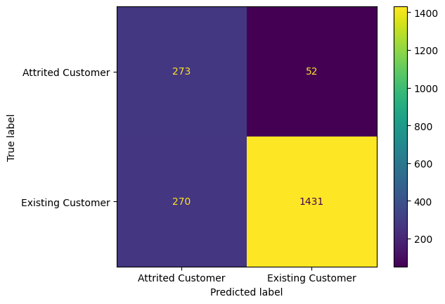

<table style="text-align: center">
	<tr>
		<th>Class</th>
		<th>Precision</th>
		<th>Recall</th>
		<th>F1-Score</th>
	</tr>
	<tr>
		<td><i>Attrited Customer</i></td>
		<td>0.50</td>
		<td>0.84</td>
		<td>0.63</td>
	</tr>
	<tr>
		<td><i>Current Customer</i></td>
		<td>0.96</td>
		<td>0.84</td>
		<td>0.90</td>
	</tr>
	<tr>
		<td style="border-top: 2px solid; font-weight: bold">Overall Acurracy</td>
		<td style="border-top: 2px solid; font-weight: bold" colspan="3">0.84</td>
	</tr>
</table>


The first model evaluated was Logistic Regression. The overall accuracy was 84%, indicating a strong ability to predict results correctly. However, an individual analysis of the metrics reveals that the precision was only 50%. This signifies that among all positive predictions (churn), only 50% were actually true positives. Consequently, the model exhibits a high propensity to incorrectly classify clients as churners.

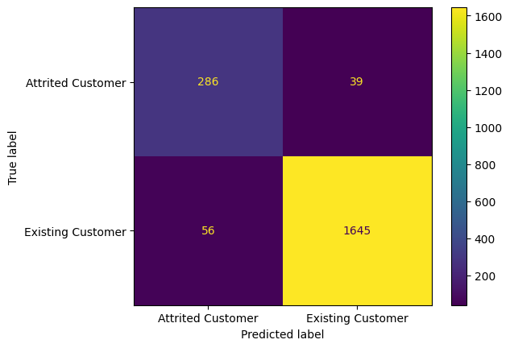

<table style="text-align: center">
	<tr>
		<th>Class</th>
		<th>Precision</th>
		<th>Recall</th>
		<th>F1-Score</th>
	</tr>
	<tr>
		<td><i>Attrited Customer</i></td>
		<td>0.84</td>
		<td>0.88</td>
		<td>0.86</td>
	</tr>
	<tr>
		<td><i>Current Customer</i></td>
		<td>0.98</td>
		<td>0.97</td>
		<td>0.97</td>
	</tr>
	<tr>
		<td style="border-top: 2px solid; font-weight: bold">Overall Acurracy</td>
		<td style="border-top: 2px solid; font-weight: bold" colspan="3">0.95</td>
	</tr>
</table>

The Random Forest Classifier also exhibited high accuracy, achieving a score of 95%. Analyzing the individual metrics revealed a superior performance compared to Logistic Regression, particularly in precision. Random Forest demonstrated a significantly higher precision of 84% in the _Attrited Customer_ class.